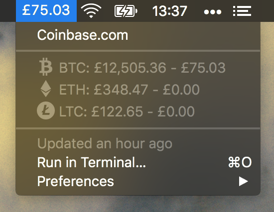

# BitBar Coinbase Wallet
> 💰 Coinbase wallet and cryptocurrency price tracker plugin for BitBar



## 📦 Install

1. Install [BitBar](https://github.com/matryer/bitbar)
2. Clone this repository into your BitBar plugin directory
3. Rename `config.sample.js` to `config.js`
4. Add your [Coinbase API](https://www.coinbase.com/settings/api) key & secret to `config.js`
5. Symlink the plugin entry point to your BitBar plugin directory:

```sh
ln -s bitbar-coinbase-wallet/src/app.js bitbar-coinbase-wallet.1m.js
```

## 🚀 Features

- Displays your total Coinbase wallet value in the menubar
- Displays your Coinbase wallet currency values in the dropdown
- Displays current Coinbase exchange rates for BTC, ETH & LTC
- Values are in GBP - hold `alt` to view USD


## 📄 License

This project is licensed under the MIT License - see the [LICENSE.md](LICENSE.md) file for details.
